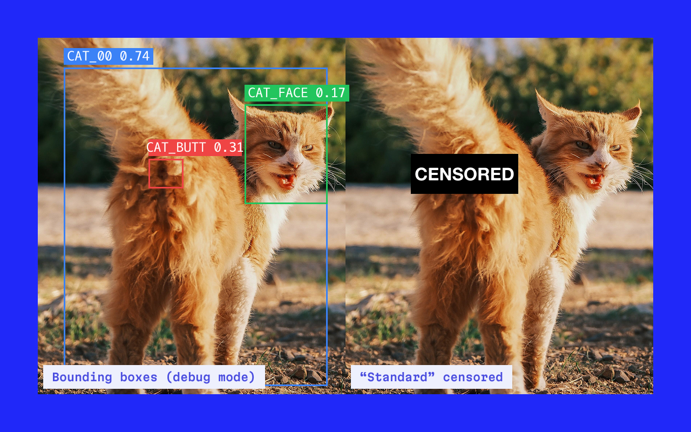

# RearAware Chrome Extension (Beta)

Because your cat has no sense of professional boundaries.

RearAware is a real-time AI webcam filter that detects and censors cat butts during video calls. Powered by a custom-trained YOLO model running entirely on-device via ONNX Runtime and WebGPU. It identifies feline rear ends in real time and automatically covers them with your choice of censor overlay. No video ever leaves your computer.

Supports Google Meet and Microsoft Teams.



## Features

- 🐈 Real-time cat butt detection and censoring, powered by a custom-trained YOLO model
- 🎭 Three censor styles to choose from: Standard, All-seeing, and Nicolas Cage
- 🎚️ Adjustable confidence threshold, so you can tune how sensitive detection is
- ⚡ GPU-accelerated (WebGPU) with an automatic fallback to CPU if WebGPU isn't available
- 🔊 Random sound effects on detection (mutable)
- 🐛 Developer mode with a bounding boxes debug overlay, for anyone curious what the model's actually seeing
- 🔒 100% on device (no video, images, or data are ever sent anywhere)
- 🎨 A popup that's honestly more designed than a joke browser extension has any right to be

## Installation

**Chrome Web Store:**
https://chromewebstore.google.com/detail/bhehiighjgekghjjmdhjkloflobanmad?utm_source=item-share-cb

**Manual install (for developers):**

Requires Node.js installed

1. Download or clone this repo.
2. Open a terminal in the project folder and install dependencies:
   ```bash
   npm install
   ```
3. Build the extension:
   ```bash
   npm run build
   ```
4. Open `chrome://extensions` in Chrome.
5. Enable **Developer mode** (top right).
6. Click **Load unpacked** and select the `dist` folder.

## Using it in a meeting

1. Make sure RearAware is enabled.
2. Join a video call on **Google Meet** or **Microsoft Teams**.
3. That's it :) your cat's dignity is now protected.

Everything else (sound, obfuscation style, confidence threshold, and a developer-mode debug overlay) is adjustable any time from the extension popup.

### Popup settings

- **Detection:** master on/off switch for the whole extension.
- **Confidence threshold:** how confident the model needs to be before it censors something. Lower values catch more cats but risk more false positives.
- **Obfuscation type:** pick your censor style:
  - **Standard:** the classic censor sticker.
  - **All-seeing:** a looping Eye of Sauron.
  - **Nicolas Cage:** no further explanation offered.
- **Audio feedback:** random sound effect on detection, mutable.
- **Developer mode → Bounding boxes (debug):** draws the model's raw detection boxes (cat / face / butt, with confidence scores) instead of a sticker, for debugging or curiosity. The obfuscation picker is disabled while this is on, since nothing's being censored in this mode.

## Notes

- Works best with good lighting and a clear view of the cat.
- The model was trained on cats only, not dogs, humans, or anything else.
- Sound effects are random. You're welcome.
- Detection isn't perfect yet. It may occasionally miss a butt, or very rarely censor something that isn't one. It's a fun tool, not a guarantee.
- Requires a browser with WebGPU support (recent versions of Chrome) for full speed; falls back to a slower CPU-only mode otherwise.
- Multiple tabs with active calls (e.g. Meet and Teams open at once) are supported - detection is shared fairly across them rather than conflicting.

## How it works

- A custom YOLO model (trained with Ultralytics and exported to ONNX) detects three classes: cat, face and butt.
- Inference runs in a background **offscreen document** rather than directly in the page, using [onnxruntime-web](https://github.com/microsoft/onnxruntime) with the WebGPU execution provider when available. This keeps detection working even on sites (like Teams) whose own security policy would otherwise block it.
- A content script captures webcam frames from the call's video element, sends them to the offscreen document for detection, and overlays your chosen censor style positioned and scaled to match the detected region (including correcting for a mirrored self-view).

**Dedicated to Wolfe Shah 🩶**

⚠️ Early beta ⚠️ This is a hobby project, not a polished product. Detection isn't perfect: it may occasionally miss a butt, or censor something that isn't one. Expect bugs, and expect it to get better over time!
